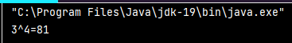

## Java-Ex-06
### Define a method to calculate power of a number raised to other i.e. ab using recursion where the numbers 'a' and 'b' are to be entered by the user
## Aim:-
### To write a Java program to create a method to calculate power of a number raised to other.

## Algorithm:-
### Step 1 : 
Open Intelli J application or any other code editor.

### Step 2 : 
Create a class called "Power" and create a method.

### Step 3 : 
Create a main class,called the "Solution".

### Step 4 : 
Call the method from the Power class in Solution.

### Step 5 : 
Display the result using Solution Class in the terminal.

## Program :-
```java
class Power {
public static void main(String[] args) {
int base = 3, powerRaised = 4;
int result = power(base, powerRaised);
System.out.println(base + "^" + powerRaised + "=" + result);
}
public static int power(int base, int powerRaised) {
if (powerRaised != 0) {
return (base * power(base, powerRaised - 1));
}
else {
return 1;
}
}
}
```
## Output

## Result
We have successfully created a Java program to calculate power of a number raised to other using method.